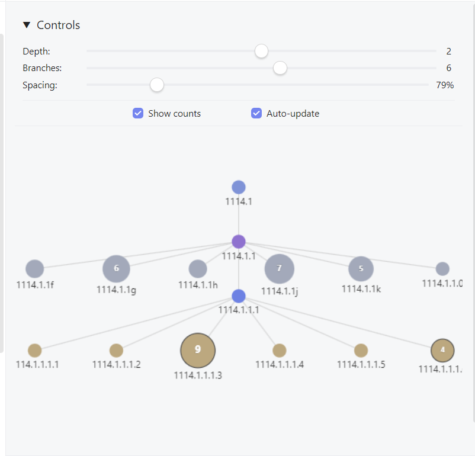

# Zettelkasten Branch Tracker

An Obsidian plugin that provides specialised graph visualisation for Zettelkasten note hierarchies. Unlike generic graph views, this plugin understands Zettelkasten ID numbering systems and displays the branching relationships in an intuitive, navigable format.

## Features

### 🌳 **4-Tier Hierarchy Visualisation**
- **Great-Grandparents** (Tier -4): Contextual top-level ancestors
- **Grandparents/Aunts-Uncles** (Tier -3/-2): Parent notes and their siblings  
- **Current Note + Siblings** (Tier -1/0): Current note with linear continuations and siblings
- **Children** (Tier 1): True branching children with dot notation

### 🎨 **Smart Visual Design**
- **Colour-coded levels**: Each tier has distinct colours for easy navigation
- **Node sizing**: Nodes scale based on the number of sub-notes they contain
- **Interactive elements**: Smooth hover effects, animations, and visual feedback
- **Connection types**: Solid lines for hierarchical relationships, dotted lines for linear sequences

### 🔧 **Interactive Controls**
- **Depth slider**: Show 1-3 levels of hierarchy depth
- **Branch limit**: Control maximum branches shown per level (1-10)
- **Spacing control**: Adjust layout spacing (50%-200%)
- **Toggle options**: Show/hide subnote counts, enable/disable auto-update
- **Pan and zoom**: Full mouse interaction with click-drag panning and scroll wheel zoom

### 📋 **Zettelkasten ID Support**
Handles complex ID formats including:
- Basic sequences: `1114`, `1114a`, `1114b`
- Branching: `1114.1`, `1114.2`, `1114.1.1`
- Mixed notation: `2311.4b1.1b1.2.4`
- Linear continuations: `1114a1`, `1114a2`

## Demo
Watch the plugin in action (50 seconds):

## Installation

### Manual Installation
1. Download the latest release
2. Extract the files to your vault's plugins folder: `.obsidian/plugins/zettelkasten-branch-tracker/`
3. The folder should contain:
   - `main.js`
   - `manifest.json`
4. Enable the plugin in Obsidian Settings → Community Plugins

### From Community Plugins
*Coming soon - plugin is in development for community plugin directory submission*

## Usage

### Opening the Branch View
- **Ribbon icon**: Click the branch icon in the left sidebar
- **Command palette**: Search for "Open Zettelkasten Branch View"
- **Hotkey**: Assign a custom hotkey in Settings

### Navigation
- **Click nodes**: Navigate to any note in the hierarchy
- **Ctrl/Cmd+Click**: Open notes in new tabs
- **Mouse wheel**: Zoom in and out
- **Click and drag**: Pan around the view
- **Auto-update**: Automatically refresh when switching between notes (optional)

### Controls
The collapsible control panel provides:
- **Depth**: How many levels up/down to show
- **Branches**: Maximum number of siblings/children to display
- **Spacing**: Adjust node spacing for better visibility
- **Show counts**: Display number of sub-notes inside each node
- **Auto-update**: Refresh view when switching notes

## Supported ID Formats

The plugin automatically detects and parses various Zettelkasten ID patterns:

| Format | Example | Relationship |
|--------|---------|--------------|
| Basic sequence | `1114` → `1114a` → `1114b` | Linear continuation |
| Branching | `1114` → `1114.1` → `1114.2` | True hierarchical children |
| Complex | `2311.4b1.1b1.2.4` | Mixed linear and hierarchical |
| Numeric | `1150.1a.1a1` | Letter-number combinations |

## Visual Guide

### Node Colours by Level
- **Blue** (Current): The note you're currently viewing
- **Teal** (Continuations): Linear sequence continuations
- **Gray** (Siblings): Sibling notes at the same level
- **Purple** (Parents): Direct parent notes
- **Light Blue** (Grandparents): Grandparent level
- **Orange** (Children): Branching children

### Connection Types
- **Solid lines**: Hierarchical parent-child relationships
- **Dotted lines**: Linear sequence continuations

## Settings

Configure default behaviour in Settings → Plugin Options → Zettelkasten Branch Tracker:

- **Default maximum depth**: Initial depth level (1-3)
- **Default maximum branches**: Initial branch limit (1-10)
- **Horizontal spacing**: Space between sequential nodes
- **Vertical spacing**: Space between hierarchical levels

## Development Status

### ✅ **Completed Features**
- Complete hierarchy parsing and visualisation
- Interactive controls and navigation
- Smooth animations and hover effects
- Auto-update functionality
- Node sizing based on content depth
- Support for complex ID formats

### 🔧 **Known Issues**
- Some edge cases in hierarchy parsing for very complex IDs
- Mobile responsiveness could be improved

## Technical Notes

- Built with vanilla JavaScript (no TypeScript compilation issues)
- Uses HTML5 Canvas for smooth rendering
- Implements efficient event handling with `requestAnimationFrame`
- Responsive design works in Obsidian's sidebar
- Memory-efficient node caching and animation systems

## Contributing

This plugin is actively being developed. Contributions are welcome!

### Areas needing help:
- **Mobile/touch interface** improvements  
- **Edge case testing** with complex ID formats
- **Documentation** and examples

### Development Setup
1. Clone the repository
2. Install in your test vault's `.obsidian/plugins/` directory
3. Enable Developer Console in Obsidian for debugging
4. Make changes to `main.js` and reload the plugin

## Support

- **GitHub Issues**: Report bugs and request features
- **Obsidian Forum**: General discussion and community support

## License

[MIT License](LICENSE) - Feel free to modify and distribute

---

**Note**: This plugin is specifically designed for Zettelkasten workflows using numerical ID systems. It may not work optimally with other note-taking methodologies or naming conventions.

## Acknowledgements

Claude — without whom this simple Irish troglodyte could never have vibe coded this dream into reality